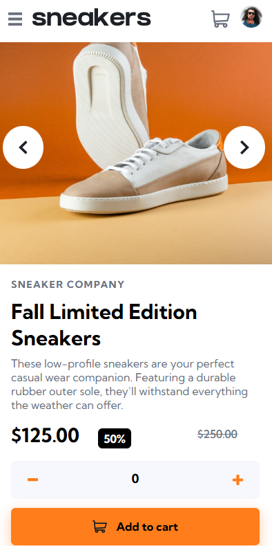
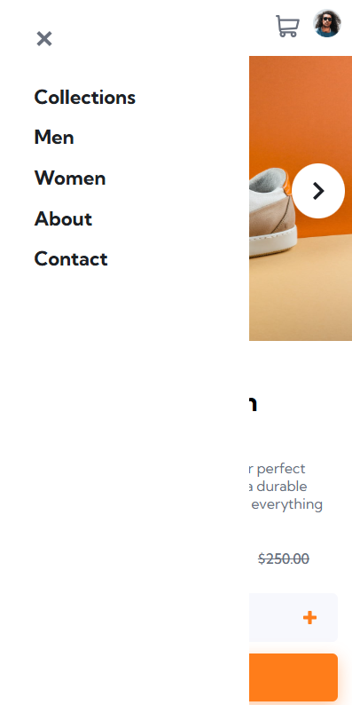
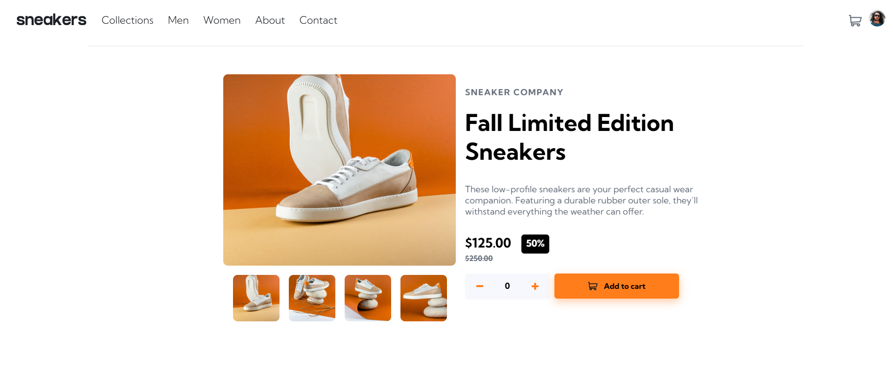
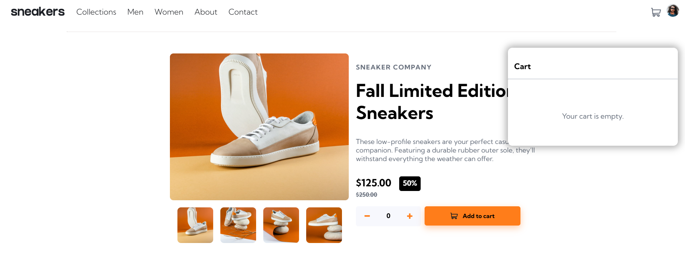
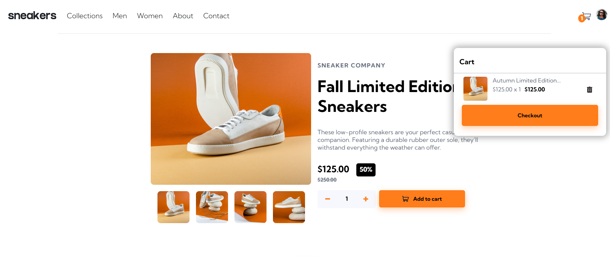

<h1 align="center"> E-commerce Product Page 💻</h1>

  <a href="#objective">Objective</a> •
  <a href="#layout">Challlenge Site</a> •
  <a href="#technologies">Technologies</a> •
  <a href="#about-me">About me</a> 

  <table>
  <tr>
    <td>
      <h4><em>Mobile Design</em></h4>
      
    </td>
    <td>
      <h4><em>Mobile Menu</em></h4>
      
    </td>
  </tr>
</table>

<table>
      <td>
        <h4><em>Desktop Design</em></h4>
        
      </td>
    </tr>
    </table>
    <table>
    <tr>
      <td>
        <h4><em>Cart Empty Design</em></h4>
        
      </td>
      </tr>
      </table>
      <table>
      <tr>
      <td>
        <h4><em>Cart Filled Design</em></h4>
        
      </td>
    </tr>
  </table>
 

<h2 id="objective">Objective 🎯</h2>

This project was created by Front-End Mentor 
with a focus on training the intermediate skills of HTML, CSS and JavaScript with the purpose of helping beginners to make a form and submitting information combined with a responsive landing page. In this project
I learned to use a Javascript and the DOM manipulation and improving my css skills by doing a mobile version for different screen sizes, great responsive and web development lessons, I also learned how to build a carousel of images and how to implement keyframes effects.

Watch the preview of this project at this <a href="https://e-commerce-product-page-silk.vercel.app/">link</a>

<h2 id="layout">Challenge Site 💻</h2>

The layout design has been made available in Front-End Mentor through this <a href="https://www.frontendmentor.io/challenges/ecommerce-product-page-UPsZ9MJp6">link</a>

<h2 id="technologies">Technologies ⚡</h2>
<ul>
  <li><a href="https://developer.mozilla.org/en-US/docs/Web/HTML">HTML</a></li>
  <li><a href="https://developer.mozilla.org/en-US/docs/Web/CSS">CSS</a></li>
  <li><a href="https://developer.mozilla.org/en-US/docs/Web/JavaScript/Reference">JavaScript</a></li>
</ul>

<h2 id="about-me">About me 👨🏻</h2>

My name is Bruno Henrique, I am 18 years old and I was born and raised in Brazil. I'm looking for my first opportunity in the web development, focusing on the JavaScript stack. I'm training my skills in HTML5, CSS3 and Javascript. I'm currently studying these technologies to solidify my knowledge in Front-End web development. 
